# Employee Attrition
Employee attrition describes the departure of staff, be it for voluntary or involuntary reasons. Employers, obviously, have a vested interest in retaining high-quality employees. Therefore, a model that identifies employees who are at risk of leaving the company can be a valuable cost-saving tool.

# Imports


```python
import numpy as np
import pandas as pd
import seaborn as sns
import matplotlib.pyplot as plt
import matplotlib.colors
import scipy.stats
import sklearn.decomposition.pca
import sklearn.cluster
import sklearn.model_selection
import sklearn.ensemble
import sklearn.metrics
np.random.seed(991)
```

# The Data
The data used for this project contains the following features split across a training and a test file:

| Column Name           | Description |
| --------------------- | ----------- |
| id                    | Employee id |
| satisfaction          | Satisfaction level in percentiles | 
| last_evaluation       | Employee’s last performance score in percentiles | 
| number_projects       | Number of projects being handled by the employee | 
| average_monthly_hours | Average monthly hours worked |
| time_spent_company    | Number of years spent with the company |
| num_work_accidents    | Number of work accidents encountered |
| left                  | “1” indicates that the employee has left the company and “0” indicates otherwise. |
| promotion_last_5years | "1" indicates that the employee has been promoted in the last 5-years. “0” indicates otherwise. |
| department            | Indicate area of operations |
| salary                | The level of salary |

The test file (obviously) does not contain the `left` column.


```python
# Load data
employees = pd.read_csv("hr_attrition_train.csv", index_col=0)
employees.head()
```


<div>
<style scoped>
    .dataframe tbody tr th:only-of-type {
        vertical-align: middle;
    }

    .dataframe tbody tr th {
        vertical-align: top;
    }

    .dataframe thead th {
        text-align: right;
    }
</style>
<table border="1" class="dataframe">
  <thead>
    <tr style="text-align: right;">
      <th></th>
      <th>satisfaction_level</th>
      <th>last_evaluation</th>
      <th>number_projects</th>
      <th>average_monthly_hours</th>
      <th>time_spent_company</th>
      <th>num_work_accidents</th>
      <th>left</th>
      <th>promotion_last_5years</th>
      <th>department</th>
      <th>salary</th>
    </tr>
    <tr>
      <th>id</th>
      <th></th>
      <th></th>
      <th></th>
      <th></th>
      <th></th>
      <th></th>
      <th></th>
      <th></th>
      <th></th>
      <th></th>
    </tr>
  </thead>
  <tbody>
    <tr>
      <th>1</th>
      <td>0.38</td>
      <td>0.53</td>
      <td>2</td>
      <td>157</td>
      <td>3</td>
      <td>0</td>
      <td>1</td>
      <td>0</td>
      <td>sales</td>
      <td>low</td>
    </tr>
    <tr>
      <th>2</th>
      <td>0.80</td>
      <td>0.86</td>
      <td>5</td>
      <td>262</td>
      <td>6</td>
      <td>0</td>
      <td>1</td>
      <td>0</td>
      <td>sales</td>
      <td>medium</td>
    </tr>
    <tr>
      <th>3</th>
      <td>0.11</td>
      <td>0.88</td>
      <td>7</td>
      <td>272</td>
      <td>4</td>
      <td>0</td>
      <td>1</td>
      <td>0</td>
      <td>sales</td>
      <td>medium</td>
    </tr>
    <tr>
      <th>4</th>
      <td>0.72</td>
      <td>0.87</td>
      <td>5</td>
      <td>223</td>
      <td>5</td>
      <td>0</td>
      <td>1</td>
      <td>0</td>
      <td>sales</td>
      <td>low</td>
    </tr>
    <tr>
      <th>5</th>
      <td>0.37</td>
      <td>0.52</td>
      <td>2</td>
      <td>159</td>
      <td>3</td>
      <td>0</td>
      <td>1</td>
      <td>0</td>
      <td>sales</td>
      <td>low</td>
    </tr>
  </tbody>
</table>
</div>


```python
employees.describe(include='all')
```


<div>
<style scoped>
    .dataframe tbody tr th:only-of-type {
        vertical-align: middle;
    }

    .dataframe tbody tr th {
        vertical-align: top;
    }

    .dataframe thead th {
        text-align: right;
    }
</style>
<table border="1" class="dataframe">
  <thead>
    <tr style="text-align: right;">
      <th></th>
      <th>satisfaction_level</th>
      <th>last_evaluation</th>
      <th>number_projects</th>
      <th>average_monthly_hours</th>
      <th>time_spent_company</th>
      <th>num_work_accidents</th>
      <th>left</th>
      <th>promotion_last_5years</th>
      <th>department</th>
      <th>salary</th>
    </tr>
  </thead>
  <tbody>
    <tr>
      <th>count</th>
      <td>13000.000000</td>
      <td>13000.000000</td>
      <td>13000.000000</td>
      <td>13000.000000</td>
      <td>13000.000000</td>
      <td>13000.000000</td>
      <td>13000.000000</td>
      <td>13000.000000</td>
      <td>13000</td>
      <td>13000</td>
    </tr>
    <tr>
      <th>unique</th>
      <td>NaN</td>
      <td>NaN</td>
      <td>NaN</td>
      <td>NaN</td>
      <td>NaN</td>
      <td>NaN</td>
      <td>NaN</td>
      <td>NaN</td>
      <td>10</td>
      <td>3</td>
    </tr>
    <tr>
      <th>top</th>
      <td>NaN</td>
      <td>NaN</td>
      <td>NaN</td>
      <td>NaN</td>
      <td>NaN</td>
      <td>NaN</td>
      <td>NaN</td>
      <td>NaN</td>
      <td>sales</td>
      <td>low</td>
    </tr>
    <tr>
      <th>freq</th>
      <td>NaN</td>
      <td>NaN</td>
      <td>NaN</td>
      <td>NaN</td>
      <td>NaN</td>
      <td>NaN</td>
      <td>NaN</td>
      <td>NaN</td>
      <td>3536</td>
      <td>6312</td>
    </tr>
    <tr>
      <th>mean</th>
      <td>0.618806</td>
      <td>0.716709</td>
      <td>3.804077</td>
      <td>200.909769</td>
      <td>3.390000</td>
      <td>0.147077</td>
      <td>0.214077</td>
      <td>0.016462</td>
      <td>NaN</td>
      <td>NaN</td>
    </tr>
    <tr>
      <th>std</th>
      <td>0.246630</td>
      <td>0.170237</td>
      <td>1.209814</td>
      <td>49.484224</td>
      <td>1.312204</td>
      <td>0.354196</td>
      <td>0.410196</td>
      <td>0.127247</td>
      <td>NaN</td>
      <td>NaN</td>
    </tr>
    <tr>
      <th>min</th>
      <td>0.090000</td>
      <td>0.360000</td>
      <td>2.000000</td>
      <td>96.000000</td>
      <td>2.000000</td>
      <td>0.000000</td>
      <td>0.000000</td>
      <td>0.000000</td>
      <td>NaN</td>
      <td>NaN</td>
    </tr>
    <tr>
      <th>25%</th>
      <td>0.450000</td>
      <td>0.560000</td>
      <td>3.000000</td>
      <td>156.000000</td>
      <td>3.000000</td>
      <td>0.000000</td>
      <td>0.000000</td>
      <td>0.000000</td>
      <td>NaN</td>
      <td>NaN</td>
    </tr>
    <tr>
      <th>50%</th>
      <td>0.650000</td>
      <td>0.720000</td>
      <td>4.000000</td>
      <td>200.000000</td>
      <td>3.000000</td>
      <td>0.000000</td>
      <td>0.000000</td>
      <td>0.000000</td>
      <td>NaN</td>
      <td>NaN</td>
    </tr>
    <tr>
      <th>75%</th>
      <td>0.820000</td>
      <td>0.870000</td>
      <td>5.000000</td>
      <td>244.000000</td>
      <td>4.000000</td>
      <td>0.000000</td>
      <td>0.000000</td>
      <td>0.000000</td>
      <td>NaN</td>
      <td>NaN</td>
    </tr>
    <tr>
      <th>max</th>
      <td>1.000000</td>
      <td>1.000000</td>
      <td>7.000000</td>
      <td>310.000000</td>
      <td>10.000000</td>
      <td>1.000000</td>
      <td>1.000000</td>
      <td>1.000000</td>
      <td>NaN</td>
      <td>NaN</td>
    </tr>
  </tbody>
</table>
</div>


The first $5$ features are numerical in nature but the remaining 5 are categorical. "num_work_accidents" is described as a numerical feature in the metadata but because it can only take on values of $0$ and $1$ (see min/max above and the number of unique values below), it may as well be treated as a boolean.


```python
employees.nunique()
```


    satisfaction_level        92
    last_evaluation           65
    number_projects            6
    average_monthly_hours    215
    time_spent_company         8
    num_work_accidents         2
    left                       2
    promotion_last_5years      2
    department                10
    salary                     3
    dtype: int64


I convert the individual columns to the most "reasonable" data type.


```python
employees["satisfaction_level"] = employees["satisfaction_level"].astype(float)
employees["last_evaluation"] = employees["last_evaluation"].astype(float)
employees["number_projects"] = employees["number_projects"].astype(int)
employees["average_monthly_hours"] = employees["average_monthly_hours"].astype(int)
employees["time_spent_company"] = employees["time_spent_company"].astype(int)
employees["num_work_accidents"] = employees["num_work_accidents"].astype(bool)
employees["left"] = employees["left"].astype(bool)
employees["promotion_last_5years"] = employees["promotion_last_5years"].astype(bool)
employees["department"] = employees["department"].astype(str)
employees["salary"] = employees["salary"].astype(str)
```

There are no null values in the dataset.


```python
employees.isnull().any()
```


    satisfaction_level       False
    last_evaluation          False
    number_projects          False
    average_monthly_hours    False
    time_spent_company       False
    num_work_accidents       False
    left                     False
    promotion_last_5years    False
    department               False
    salary                   False
    dtype: bool


# Feature distributions
Some observations include:
- There appears to be a bimodal trend that splits employees into two, strongly overlapping groups based on the satisfaction levels, evaluation scores, and average monthly working hours.
- The number of projects and time spent at the company appear to be poisson distributed
- Hardly any employees were promoted in the past 5 years. The importance of this feature in any model should be closely observed to prevent overfitting.


```python
fig, ax = plt.subplots(5, 2, figsize=(14, 28));
sns.distplot(employees["satisfaction_level"], bins=10, ax=ax[0, 0]);
sns.distplot(employees["last_evaluation"], bins=10, ax=ax[0, 1]);
sns.distplot(employees["average_monthly_hours"], bins=10, ax=ax[1, 0]);
sns.countplot(employees["number_projects"], color="skyblue", ax=ax[1, 1]);
sns.countplot(employees["time_spent_company"], color="skyblue", ax=ax[2, 0]);
sns.countplot(employees["num_work_accidents"], color="skyblue", ax=ax[2, 1]);
sns.countplot(employees["left"], color="skyblue", ax=ax[3, 0]);
sns.countplot(employees["promotion_last_5years"], color="skyblue", ax=ax[3, 1]);
sns.countplot(y=employees["department"], color="skyblue", ax=ax[4, 0]);
sns.countplot(employees["salary"], color="skyblue", ax=ax[4, 1]);
```


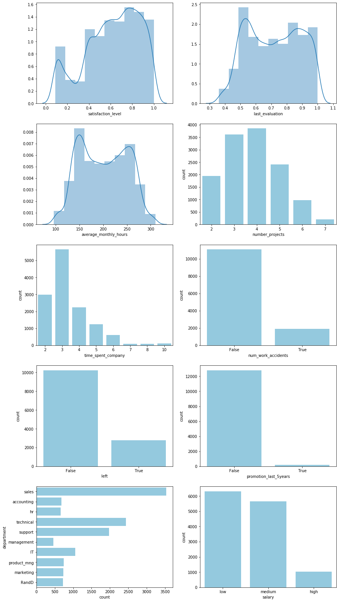


# Individual feature relationships
If we split employees into two groups, those who have left and those who haven't, then the first step is to look at how individual features vary between these groups independently.


```python
fig, ax = plt.subplots(5, 2, figsize=(14, 28));
sns.boxplot(data=employees, x="left", y="satisfaction_level", ax=ax[0, 0]);
sns.boxplot(data=employees, x="left", y="last_evaluation", ax=ax[0, 1]);
sns.boxplot(data=employees, x="left", y="average_monthly_hours", ax=ax[1, 0]);
sns.countplot(data=employees, x="number_projects", hue="left", ax=ax[1, 1]);
sns.countplot(data=employees, x="time_spent_company", hue="left", ax=ax[2, 0]);
sns.countplot(data=employees, x="num_work_accidents", hue="left", ax=ax[2, 1]);
sns.countplot(data=employees, x="promotion_last_5years", hue="left", ax=ax[3, 0]);
sns.countplot(data=employees, y="department", hue="left", ax=ax[4, 0]);
sns.countplot(data=employees, x="salary", hue="left", ax=ax[3, 1]);
ax[4, 1].axis("off");
```


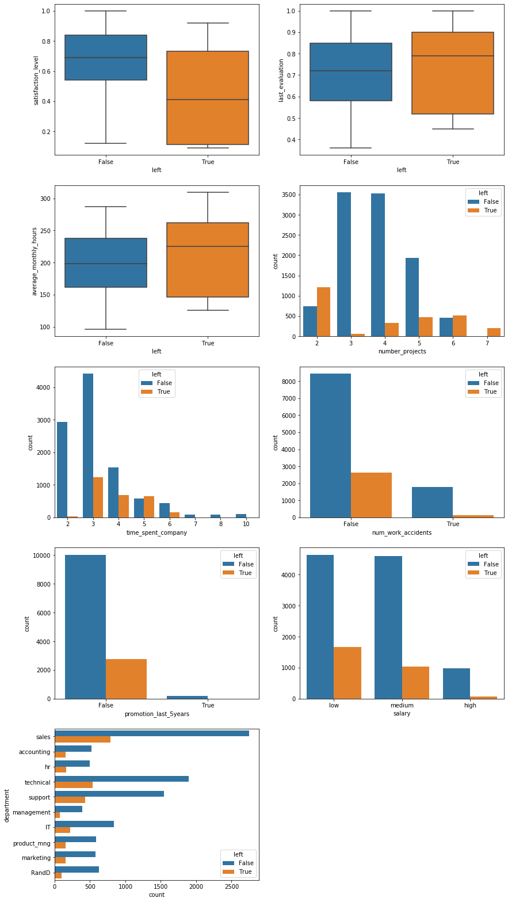


Several initial hypotheses can be formed from these visuals:

- As expected, satisfaction level plays an important role in whether an employee leaves the company.
- Employees with both a large **and** small number of projects, i.e. over- and underworked employees, are more likely to leave. The employees that stay at the company occupy a "golden middle" in terms of workload.
- The vast majority of leaving employees only do so after at least $3$ years at the company. However, once an employee stays for a very long time, at least $6$ years, they appear to remain loyal to the company.

Of particular note is that every single employee with $7$ projects left the company. This is a total of $202$ employees.


```python
(employees["number_projects"] == 7).sum()
```


    202


The barplots can also be normalized to show relative frequencies rather than absolute counts. This lets us ignore the class imbalance since the majority of employees in the dataset did not leave the company.


```python
fig, ax = plt.subplots(3, 2, figsize=(14, 14));
sns.barplot(
    data=employees.groupby(["number_projects", "left"]).size().unstack().apply(
        lambda x: x/x.sum(), axis=1).reset_index().melt(
        id_vars="number_projects", value_name="frequency"), 
    x="number_projects", y="frequency", hue="left", ax=ax[0, 0]);
sns.barplot(
    data=employees.groupby(["time_spent_company", "left"]).size().unstack().apply(
        lambda x: x/x.sum(), axis=1).reset_index().melt(
        id_vars="time_spent_company", value_name="frequency"), 
    x="time_spent_company", y="frequency", hue="left", ax=ax[0, 1]);
sns.barplot(
    data=employees.groupby(["num_work_accidents", "left"]).size().unstack().apply(
        lambda x: x/x.sum(), axis=1).reset_index().melt(
        id_vars="num_work_accidents", value_name="frequency"), 
    x="num_work_accidents", y="frequency", hue="left", ax=ax[1, 0]);
sns.barplot(
    data=employees.groupby(["promotion_last_5years", "left"]).size().unstack().apply(
        lambda x: x/x.sum(), axis=1).reset_index().melt(
        id_vars="promotion_last_5years", value_name="frequency"), 
    x="promotion_last_5years", y="frequency", hue="left", ax=ax[1, 1]);
sns.barplot(
    data=employees.groupby(["department", "left"]).size().unstack().apply(
        lambda x: x/x.sum(), axis=1).reset_index().melt(
        id_vars="department", value_name="frequency"), 
    y="department", x="frequency", hue="left", ax=ax[2, 0]);
sns.barplot(
    data=employees.groupby(["salary", "left"]).size().unstack().apply(
        lambda x: x/x.sum(), axis=1).reset_index().melt(
        id_vars="salary", value_name="frequency"), 
    x="salary", y="frequency", hue="left", ax=ax[2, 1], 
    order=["low", "medium", "high"]);
```


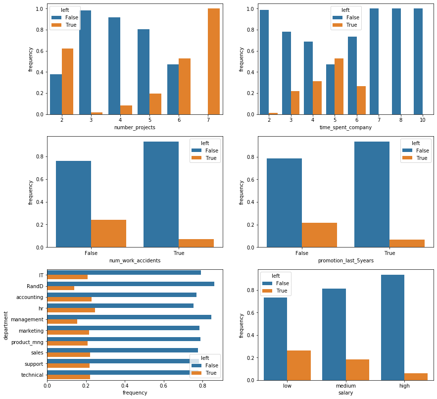


From the normalized barplots we can see the following:
- Work accidents, surprisingly, _decrease_ the probability of an employee leaving the company. It is worth noting that there may be an inherent bias in this assertion as it is unknown whether this data set includes leaving employees who became unable to work due to injuries.
- Receiving a promotion within the last 5 years, unsurprisingly, also decreases that probability.
- Management and R&D employees are slightly less likely to leave but for the most part, the department an employee works in seems to have an insignificant impact on their likelihood of leaving.
- The probability of leaving is, unsurprisingly, inversely proportional to an employee's salary.

## Correlations
There are weak correlations between features, in particular the number of projects, the average number of hours worked, and the last evaluation score show minor correlation. These correlation coefficients are not high enough, however, to warrant immediate concern.


```python
sns.heatmap(
    employees.corr(), cmap="coolwarm", 
    vmin=-1, vmax=1, annot=True, fmt=".2f");
```


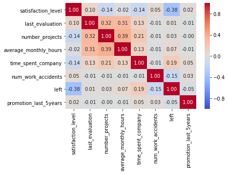


## Clustering
Clustering data with mixed continuous and categorical variables is always tricky. Nonetheless, if we look at a principal component analysis with 2 components of the continuous variables then we notice that there appear to be three main groups of employees who leave the company.


```python
pca = sklearn.decomposition.pca.PCA(n_components=2).fit_transform(
    employees.drop(
    ["num_work_accidents", "left", 
     "promotion_last_5years", "department", "salary"], 
    axis=1).apply(lambda x: (x - x.mean()) / x.std()))

fig, ax = plt.subplots();
for val, color in [(False, "magenta"), (True, "darkcyan")]:
    ax.scatter(
        pca[employees["left"].values == val, 0], 
        pca[employees["left"].values == val, 1], 
        c=color, label=val, alpha=0.3, edgecolors="none", s=20);
l = plt.legend()
l.legendHandles[0].set_alpha(1)
l.legendHandles[1].set_alpha(1)
l.legendHandles[0].set_sizes((50,))
l.legendHandles[1].set_sizes((50,))
```


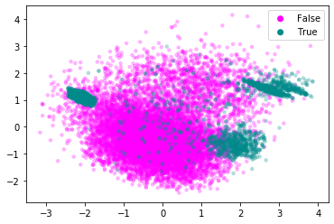


Let's attempt to cluster these three groups.


```python
# The random_state value makes sure that my descriptions in the text are 
# consistent with the class labels.
cluster = sklearn.cluster.KMeans(n_clusters=3).fit_predict(
    pca[employees["left"].values == True, :])

fig, ax = plt.subplots();
ax.scatter(
    pca[employees["left"].values == False, 0], 
    pca[employees["left"].values == False, 1], 
    c="lightgray", label="Didn't Leave", alpha=0.3, 
    edgecolors="none", s=20);
for val, color in [(0, "magenta"), (1, "darkcyan"), (2, "yellow")]:
    pca_leavers = pca[employees["left"].values == True, :]
    ax.scatter(
        pca_leavers[cluster == val, 0], 
        pca_leavers[cluster == val, 1], 
        c=color, label="Group {}".format(val+1), alpha=0.3, 
        edgecolors="none", s=20);
l = plt.legend()
l.legendHandles[0].set_alpha(1)
l.legendHandles[1].set_alpha(1)
l.legendHandles[2].set_alpha(1)
l.legendHandles[3].set_alpha(1)
l.legendHandles[0].set_sizes((50,))
l.legendHandles[1].set_sizes((50,))
l.legendHandles[2].set_sizes((50,))
l.legendHandles[3].set_sizes((50,))
```


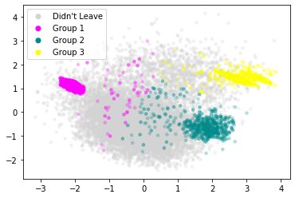


Let's now look at the distribution of features for each of these subgroups individually.


```python
leavers = employees.loc[employees["left"] == True, :].copy()
leavers["leaver_group"] = ["Group {}".format(ii+1) for ii in cluster]

fig, ax = plt.subplots(5, 2, figsize=(14, 28));
sns.boxplot(data=leavers, x="leaver_group", y="satisfaction_level",
            order=["Group 1", "Group 2", "Group 3"], ax=ax[0, 0]);
sns.boxplot(data=leavers, x="leaver_group", y="last_evaluation",
            order=["Group 1", "Group 2", "Group 3"], ax=ax[0, 1]);
sns.boxplot(data=leavers, x="leaver_group", y="average_monthly_hours",
            order=["Group 1", "Group 2", "Group 3"], ax=ax[1, 0]);
sns.countplot(data=leavers, hue="leaver_group", x="number_projects",
              hue_order=["Group 1", "Group 2", "Group 3"], ax=ax[1, 1]);
sns.countplot(data=leavers, hue="leaver_group", x="time_spent_company",
              hue_order=["Group 1", "Group 2", "Group 3"], ax=ax[2, 0]);
sns.countplot(data=leavers, hue="leaver_group", x="num_work_accidents",
              hue_order=["Group 1", "Group 2", "Group 3"], ax=ax[2, 1]);
sns.countplot(data=leavers, hue="leaver_group", x="promotion_last_5years",
              hue_order=["Group 1", "Group 2", "Group 3"], ax=ax[3, 0]);
sns.countplot(data=leavers, hue="leaver_group", y="department", 
              hue_order=["Group 1", "Group 2", "Group 3"], ax=ax[4, 0]);
sns.countplot(data=leavers, hue="leaver_group", x="salary", 
              hue_order=["Group 1", "Group 2", "Group 3"], ax=ax[3, 1]);
ax[4, 1].axis("off");
```


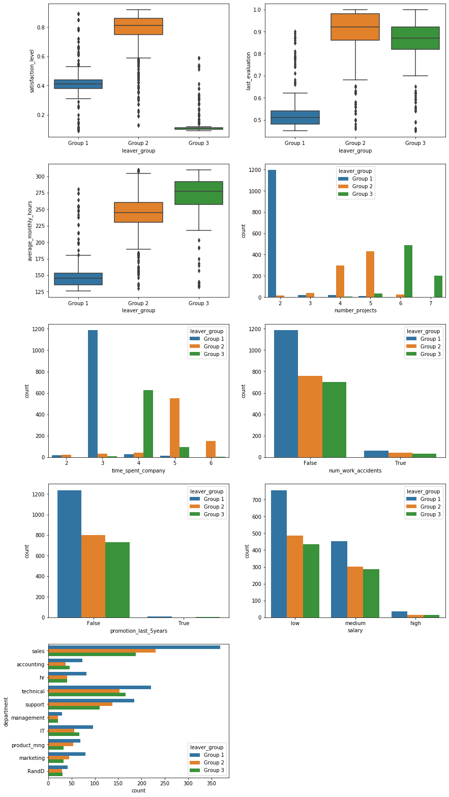


This stratification paints an interesting picture and lets us make the following hypotheses:
- Group 1 consists of employees who are underworked and evaluated poorly for it. Almost all of them stayed with the company for $3$ years but only worked on $2$ projects. Their average monthly working hours are notably lower than the other two groups. The most likely explanation is that these employees are either asked to leave by their employer or are fundamentally unhappy with and/or unsuited for their job.
- Group 2 is a curious group. They are very satisfied, scored high on their last evaluation, and appear to be in the "golden middle" with regards to the number of projects. They tend to stay with the company longer than the other two groups of leavers. These employees may have difficulty moving into senior positions within the company due to internal competition and therefore leave to advance their careers. Retirees may also fall into this group.
- Lastly, employees in group 3 are overworked. They work the longest hours, have the highest number of projects (all of the employees with $7$ projects appear to be in this group), and are extremely dissatisfied because of it. Nonetheless, they are evaluated very highly, meaning they most likely leave of their own volition to improve their work-life balance.

The categorical variables show no distinction between the groups but this is unsurprising as they were not used in the clustering.

# Predicting attrition
In order to more precisely predict employee attrition, we turn towards machine learning models that can identify more complex relationships between features.

## Converting categorical features
The first step is to convert categorical features into numerical, one-hot features. Specifically, the department and salary must be converted. The number of work accidents and the promotion status are boolean and can be used as-is.


```python
employees_dummy = pd.get_dummies(employees)
employees_dummy["leaver_group"] = employees_dummy["left"].copy()
employees_dummy.loc[employees_dummy["leaver_group"] == True, 
                    "leaver_group"] = leavers["leaver_group"]
employees_dummy.loc[employees_dummy["leaver_group"] == False, 
                    "leaver_group"] = "Didn't leave"
employees_dummy.head()
```


<div>
<style scoped>
    .dataframe tbody tr th:only-of-type {
        vertical-align: middle;
    }

    .dataframe tbody tr th {
        vertical-align: top;
    }

    .dataframe thead th {
        text-align: right;
    }
</style>
<table border="1" class="dataframe">
  <thead>
    <tr style="text-align: right;">
      <th></th>
      <th>satisfaction_level</th>
      <th>last_evaluation</th>
      <th>number_projects</th>
      <th>average_monthly_hours</th>
      <th>time_spent_company</th>
      <th>num_work_accidents</th>
      <th>left</th>
      <th>promotion_last_5years</th>
      <th>department_IT</th>
      <th>department_RandD</th>
      <th>...</th>
      <th>department_management</th>
      <th>department_marketing</th>
      <th>department_product_mng</th>
      <th>department_sales</th>
      <th>department_support</th>
      <th>department_technical</th>
      <th>salary_high</th>
      <th>salary_low</th>
      <th>salary_medium</th>
      <th>leaver_group</th>
    </tr>
    <tr>
      <th>id</th>
      <th></th>
      <th></th>
      <th></th>
      <th></th>
      <th></th>
      <th></th>
      <th></th>
      <th></th>
      <th></th>
      <th></th>
      <th></th>
      <th></th>
      <th></th>
      <th></th>
      <th></th>
      <th></th>
      <th></th>
      <th></th>
      <th></th>
      <th></th>
      <th></th>
    </tr>
  </thead>
  <tbody>
    <tr>
      <th>1</th>
      <td>0.38</td>
      <td>0.53</td>
      <td>2</td>
      <td>157</td>
      <td>3</td>
      <td>False</td>
      <td>True</td>
      <td>False</td>
      <td>0</td>
      <td>0</td>
      <td>...</td>
      <td>0</td>
      <td>0</td>
      <td>0</td>
      <td>1</td>
      <td>0</td>
      <td>0</td>
      <td>0</td>
      <td>1</td>
      <td>0</td>
      <td>Group 1</td>
    </tr>
    <tr>
      <th>2</th>
      <td>0.80</td>
      <td>0.86</td>
      <td>5</td>
      <td>262</td>
      <td>6</td>
      <td>False</td>
      <td>True</td>
      <td>False</td>
      <td>0</td>
      <td>0</td>
      <td>...</td>
      <td>0</td>
      <td>0</td>
      <td>0</td>
      <td>1</td>
      <td>0</td>
      <td>0</td>
      <td>0</td>
      <td>0</td>
      <td>1</td>
      <td>Group 2</td>
    </tr>
    <tr>
      <th>3</th>
      <td>0.11</td>
      <td>0.88</td>
      <td>7</td>
      <td>272</td>
      <td>4</td>
      <td>False</td>
      <td>True</td>
      <td>False</td>
      <td>0</td>
      <td>0</td>
      <td>...</td>
      <td>0</td>
      <td>0</td>
      <td>0</td>
      <td>1</td>
      <td>0</td>
      <td>0</td>
      <td>0</td>
      <td>0</td>
      <td>1</td>
      <td>Group 3</td>
    </tr>
    <tr>
      <th>4</th>
      <td>0.72</td>
      <td>0.87</td>
      <td>5</td>
      <td>223</td>
      <td>5</td>
      <td>False</td>
      <td>True</td>
      <td>False</td>
      <td>0</td>
      <td>0</td>
      <td>...</td>
      <td>0</td>
      <td>0</td>
      <td>0</td>
      <td>1</td>
      <td>0</td>
      <td>0</td>
      <td>0</td>
      <td>1</td>
      <td>0</td>
      <td>Group 2</td>
    </tr>
    <tr>
      <th>5</th>
      <td>0.37</td>
      <td>0.52</td>
      <td>2</td>
      <td>159</td>
      <td>3</td>
      <td>False</td>
      <td>True</td>
      <td>False</td>
      <td>0</td>
      <td>0</td>
      <td>...</td>
      <td>0</td>
      <td>0</td>
      <td>0</td>
      <td>1</td>
      <td>0</td>
      <td>0</td>
      <td>0</td>
      <td>1</td>
      <td>0</td>
      <td>Group 1</td>
    </tr>
  </tbody>
</table>
<p>5 rows × 22 columns</p>
</div>


```python
employees_dummy["left"].value_counts()
```


    False    10217
    True      2783
    Name: left, dtype: int64


```python
employees_dummy["leaver_group"].value_counts()
```


    Didn't leave    10217
    Group 1          1246
    Group 2           802
    Group 3           735
    Name: leaver_group, dtype: int64


## Class imbalance
In general, class imbalance can be handled via up- or downsampling of individual categories. A number of sampling techniques exist and could be explored. However, the number of samples in each category is much larger than the number of features. Therefore, downsampling the larger category still retains a sufficient number of data points to train a model.


```python
# downsample 'False' group
x = employees_dummy.groupby("left").apply(
    lambda x: x.sample(n = employees_dummy.groupby("left").size().min()))
y = x["left"]
x = x.drop(["left", "leaver_group"], axis=1)
y.value_counts()
```


    True     2783
    False    2783
    Name: left, dtype: int64


```python
x_train, x_test, y_train, y_test = sklearn.model_selection.train_test_split(
    x, y, test_size=0.30)
```

## Model selection
I chose a random forest model. The reasons for this are:
- The features are very heterogeneous, i.e. `satisfaction_level` and `last_evaluation` are bounded by 0 and 1, `average_monthly_hours` is effectively unbounded, `time_spent_company` and `number_projects` appear poisson distributed, and the remaining features are categorical. Normalizing them to make them compatible with a logistic regression, for example, requires assumptions I don't want to make if I don't have to.
- Ensemble methods are typically among the most powerful classification algorithms.

I will tune the number of trees in the forest as well as their maximum depth using 5-fold cross-validation.


```python
cv = sklearn.model_selection.GridSearchCV(
    estimator=sklearn.ensemble.RandomForestClassifier(), 
    param_grid={"max_depth": [3, 5, 10, 25, 50, 75, 100, None],
                "n_estimators": [5, 10, 25, 50, 75, 100, 150, 200]}, 
    n_jobs=6, cv=5, return_train_score=False).fit(x_train, y_train)
```


```python
print("Best CV score: {:.4f}".format(cv.best_score_))
print("Best parameters:")
print("    max_depth={}".format(cv.best_params_["max_depth"]))
print("    n_estimators={}".format(cv.best_params_["n_estimators"]))
```

    Best CV score: 0.9702
    Best parameters:
        max_depth=25
        n_estimators=75


## Training and Evaluation
The most basic metric, and the one that all other metrics build on, is the confusion matrix.


```python
model = cv.best_estimator_.fit(x_train, y_train)
```


```python
cm = pd.DataFrame({
    "True Label": y_test.values, 
    "Prediction": model.predict(x_test)}).groupby(
    ["True Label", "Prediction"]).size().unstack()
colormap = matplotlib.colors.LinearSegmentedColormap.from_list(
    "whitered", ["white", "darkred"])
sns.heatmap(
    cm, annot=True, fmt="d", 
    annot_kws={"fontsize": 20}, cmap=colormap);
```


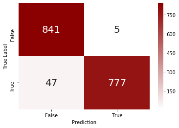


The model has some difficulty with false negatives, i.e. it misses about $5\%$ of employees that leave the company. Objectively, however, the model exhibits adequate accuracy to not require further exploration and fine-tuning of the model, i.e. it's good enough for now.

## Feature importance
A look at the feature importances of the model confirm our intuition that satisfaction level, workload (in terms of projects and working hours), time spent at the company, and evaluation scores have the biggest impact on the attrition prediction. Curiously, salary seems much less important than indicated in the EDA above. The promotion status also seems to have little impact on the model predictions.


```python
pd.DataFrame({
    "Feature": x_train.columns,
    "Importance": model.feature_importances_}).sort_values(
    "Importance", ascending=False)
```


<div>
<style scoped>
    .dataframe tbody tr th:only-of-type {
        vertical-align: middle;
    }

    .dataframe tbody tr th {
        vertical-align: top;
    }

    .dataframe thead th {
        text-align: right;
    }
</style>
<table border="1" class="dataframe">
  <thead>
    <tr style="text-align: right;">
      <th></th>
      <th>Feature</th>
      <th>Importance</th>
    </tr>
  </thead>
  <tbody>
    <tr>
      <th>0</th>
      <td>satisfaction_level</td>
      <td>0.283613</td>
    </tr>
    <tr>
      <th>4</th>
      <td>time_spent_company</td>
      <td>0.230407</td>
    </tr>
    <tr>
      <th>3</th>
      <td>average_monthly_hours</td>
      <td>0.158893</td>
    </tr>
    <tr>
      <th>1</th>
      <td>last_evaluation</td>
      <td>0.136137</td>
    </tr>
    <tr>
      <th>2</th>
      <td>number_projects</td>
      <td>0.135963</td>
    </tr>
    <tr>
      <th>5</th>
      <td>num_work_accidents</td>
      <td>0.011413</td>
    </tr>
    <tr>
      <th>18</th>
      <td>salary_low</td>
      <td>0.007576</td>
    </tr>
    <tr>
      <th>16</th>
      <td>department_technical</td>
      <td>0.005512</td>
    </tr>
    <tr>
      <th>14</th>
      <td>department_sales</td>
      <td>0.004344</td>
    </tr>
    <tr>
      <th>17</th>
      <td>salary_high</td>
      <td>0.004275</td>
    </tr>
    <tr>
      <th>19</th>
      <td>salary_medium</td>
      <td>0.003658</td>
    </tr>
    <tr>
      <th>15</th>
      <td>department_support</td>
      <td>0.003389</td>
    </tr>
    <tr>
      <th>10</th>
      <td>department_hr</td>
      <td>0.002413</td>
    </tr>
    <tr>
      <th>6</th>
      <td>promotion_last_5years</td>
      <td>0.002339</td>
    </tr>
    <tr>
      <th>7</th>
      <td>department_IT</td>
      <td>0.002125</td>
    </tr>
    <tr>
      <th>8</th>
      <td>department_RandD</td>
      <td>0.002030</td>
    </tr>
    <tr>
      <th>9</th>
      <td>department_accounting</td>
      <td>0.001810</td>
    </tr>
    <tr>
      <th>12</th>
      <td>department_marketing</td>
      <td>0.001460</td>
    </tr>
    <tr>
      <th>11</th>
      <td>department_management</td>
      <td>0.001427</td>
    </tr>
    <tr>
      <th>13</th>
      <td>department_product_mng</td>
      <td>0.001215</td>
    </tr>
  </tbody>
</table>
</div>


## Predicting attrition in test data file
As part of the assessment, I want to apply the model to the test data set.


```python
# Load data
employees_test = pd.read_csv("hr_attrition_test.csv", index_col=0)
employees_test.head()
```


<div>
<style scoped>
    .dataframe tbody tr th:only-of-type {
        vertical-align: middle;
    }

    .dataframe tbody tr th {
        vertical-align: top;
    }

    .dataframe thead th {
        text-align: right;
    }
</style>
<table border="1" class="dataframe">
  <thead>
    <tr style="text-align: right;">
      <th></th>
      <th>satisfaction_level</th>
      <th>last_evaluation</th>
      <th>number_projects</th>
      <th>average_monthly_hours</th>
      <th>time_spent_company</th>
      <th>num_work_accidents</th>
      <th>promotion_last_5years</th>
      <th>department</th>
      <th>salary</th>
    </tr>
    <tr>
      <th>id</th>
      <th></th>
      <th></th>
      <th></th>
      <th></th>
      <th></th>
      <th></th>
      <th></th>
      <th></th>
      <th></th>
    </tr>
  </thead>
  <tbody>
    <tr>
      <th>13001</th>
      <td>0.62</td>
      <td>0.94</td>
      <td>4</td>
      <td>252</td>
      <td>4</td>
      <td>0</td>
      <td>0</td>
      <td>accounting</td>
      <td>low</td>
    </tr>
    <tr>
      <th>13002</th>
      <td>0.38</td>
      <td>0.52</td>
      <td>2</td>
      <td>171</td>
      <td>3</td>
      <td>0</td>
      <td>0</td>
      <td>accounting</td>
      <td>medium</td>
    </tr>
    <tr>
      <th>13003</th>
      <td>0.80</td>
      <td>0.77</td>
      <td>4</td>
      <td>194</td>
      <td>3</td>
      <td>0</td>
      <td>0</td>
      <td>accounting</td>
      <td>medium</td>
    </tr>
    <tr>
      <th>13004</th>
      <td>0.61</td>
      <td>0.42</td>
      <td>3</td>
      <td>104</td>
      <td>2</td>
      <td>0</td>
      <td>0</td>
      <td>hr</td>
      <td>medium</td>
    </tr>
    <tr>
      <th>13005</th>
      <td>0.61</td>
      <td>0.56</td>
      <td>4</td>
      <td>176</td>
      <td>3</td>
      <td>0</td>
      <td>0</td>
      <td>hr</td>
      <td>medium</td>
    </tr>
  </tbody>
</table>
</div>


Features are similarly distributed in the test dataset and there are no missing values


```python
fig, ax = plt.subplots(5, 2, figsize=(14, 28));
sns.distplot(employees_test["satisfaction_level"], bins=10, ax=ax[0, 0]);
sns.distplot(employees_test["last_evaluation"], bins=10, ax=ax[0, 1]);
sns.distplot(employees_test["average_monthly_hours"], bins=10, ax=ax[1, 0]);
sns.countplot(employees_test["number_projects"], color="skyblue", ax=ax[1, 1]);
sns.countplot(employees_test["time_spent_company"], color="skyblue", ax=ax[2, 0]);
sns.countplot(employees_test["num_work_accidents"], color="skyblue", ax=ax[2, 1]);
sns.countplot(employees_test["promotion_last_5years"], color="skyblue", ax=ax[3, 0]);
sns.countplot(y=employees_test["department"], color="skyblue", ax=ax[4, 0]);
sns.countplot(employees_test["salary"], color="skyblue", ax=ax[3, 1]);
ax[4, 1].axis("off");
```


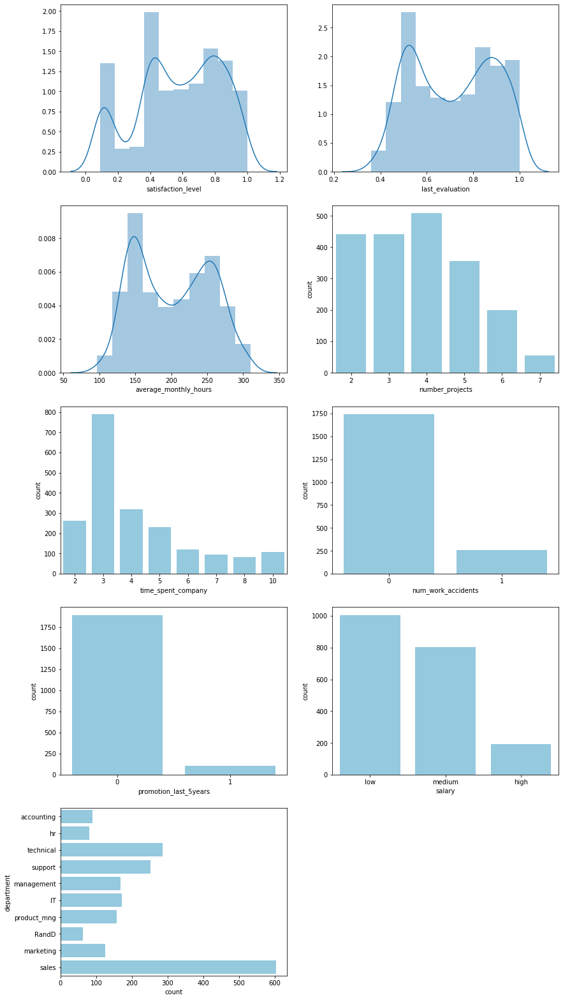


```python
employees_test.isnull().any()
```


    satisfaction_level       False
    last_evaluation          False
    number_projects          False
    average_monthly_hours    False
    time_spent_company       False
    num_work_accidents       False
    promotion_last_5years    False
    department               False
    salary                   False
    dtype: bool


Performing a PCA-style clustering with the continuous variables shows that the test data set overlaps strongly with one of the leaver groups identified earlier. We can safely assume that the test data stems from the same distribution as the training data and the model should be applicable to it.


```python
tmp = pd.concat((leavers.drop(["left", "leaver_group"], axis=1), employees_test))
tmp["traintest"] = "Train"
tmp.loc[13001:, "traintest"] = "Test"

pca = sklearn.decomposition.pca.PCA(n_components=2).fit_transform(
    tmp.drop(
    ["num_work_accidents", "promotion_last_5years", 
     "department", "salary", "traintest"], 
    axis=1).apply(lambda x: (x - x.mean()) / x.std()))

fig, ax = plt.subplots();
for val, color in [("Train", "magenta"), ("Test", "darkcyan")]:
    ax.scatter(
        pca[tmp["traintest"].values == val, 0], 
        pca[tmp["traintest"].values == val, 1], 
        c=color, label=val, alpha=0.3, edgecolors="none", s=20);
l = plt.legend()
l.legendHandles[0].set_alpha(1)
l.legendHandles[1].set_alpha(1)
l.legendHandles[0].set_sizes((50,))
l.legendHandles[1].set_sizes((50,))
```


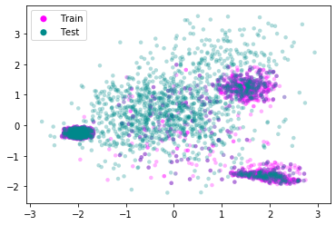


Convert categorical features


```python
employees_test_dummy = pd.get_dummies(employees_test)
employees_test_dummy.head()
```


<div>
<style scoped>
    .dataframe tbody tr th:only-of-type {
        vertical-align: middle;
    }

    .dataframe tbody tr th {
        vertical-align: top;
    }

    .dataframe thead th {
        text-align: right;
    }
</style>
<table border="1" class="dataframe">
  <thead>
    <tr style="text-align: right;">
      <th></th>
      <th>satisfaction_level</th>
      <th>last_evaluation</th>
      <th>number_projects</th>
      <th>average_monthly_hours</th>
      <th>time_spent_company</th>
      <th>num_work_accidents</th>
      <th>promotion_last_5years</th>
      <th>department_IT</th>
      <th>department_RandD</th>
      <th>department_accounting</th>
      <th>department_hr</th>
      <th>department_management</th>
      <th>department_marketing</th>
      <th>department_product_mng</th>
      <th>department_sales</th>
      <th>department_support</th>
      <th>department_technical</th>
      <th>salary_high</th>
      <th>salary_low</th>
      <th>salary_medium</th>
    </tr>
    <tr>
      <th>id</th>
      <th></th>
      <th></th>
      <th></th>
      <th></th>
      <th></th>
      <th></th>
      <th></th>
      <th></th>
      <th></th>
      <th></th>
      <th></th>
      <th></th>
      <th></th>
      <th></th>
      <th></th>
      <th></th>
      <th></th>
      <th></th>
      <th></th>
      <th></th>
    </tr>
  </thead>
  <tbody>
    <tr>
      <th>13001</th>
      <td>0.62</td>
      <td>0.94</td>
      <td>4</td>
      <td>252</td>
      <td>4</td>
      <td>0</td>
      <td>0</td>
      <td>0</td>
      <td>0</td>
      <td>1</td>
      <td>0</td>
      <td>0</td>
      <td>0</td>
      <td>0</td>
      <td>0</td>
      <td>0</td>
      <td>0</td>
      <td>0</td>
      <td>1</td>
      <td>0</td>
    </tr>
    <tr>
      <th>13002</th>
      <td>0.38</td>
      <td>0.52</td>
      <td>2</td>
      <td>171</td>
      <td>3</td>
      <td>0</td>
      <td>0</td>
      <td>0</td>
      <td>0</td>
      <td>1</td>
      <td>0</td>
      <td>0</td>
      <td>0</td>
      <td>0</td>
      <td>0</td>
      <td>0</td>
      <td>0</td>
      <td>0</td>
      <td>0</td>
      <td>1</td>
    </tr>
    <tr>
      <th>13003</th>
      <td>0.80</td>
      <td>0.77</td>
      <td>4</td>
      <td>194</td>
      <td>3</td>
      <td>0</td>
      <td>0</td>
      <td>0</td>
      <td>0</td>
      <td>1</td>
      <td>0</td>
      <td>0</td>
      <td>0</td>
      <td>0</td>
      <td>0</td>
      <td>0</td>
      <td>0</td>
      <td>0</td>
      <td>0</td>
      <td>1</td>
    </tr>
    <tr>
      <th>13004</th>
      <td>0.61</td>
      <td>0.42</td>
      <td>3</td>
      <td>104</td>
      <td>2</td>
      <td>0</td>
      <td>0</td>
      <td>0</td>
      <td>0</td>
      <td>0</td>
      <td>1</td>
      <td>0</td>
      <td>0</td>
      <td>0</td>
      <td>0</td>
      <td>0</td>
      <td>0</td>
      <td>0</td>
      <td>0</td>
      <td>1</td>
    </tr>
    <tr>
      <th>13005</th>
      <td>0.61</td>
      <td>0.56</td>
      <td>4</td>
      <td>176</td>
      <td>3</td>
      <td>0</td>
      <td>0</td>
      <td>0</td>
      <td>0</td>
      <td>0</td>
      <td>1</td>
      <td>0</td>
      <td>0</td>
      <td>0</td>
      <td>0</td>
      <td>0</td>
      <td>0</td>
      <td>0</td>
      <td>0</td>
      <td>1</td>
    </tr>
  </tbody>
</table>
</div>


Predict attrition and save in file.


```python
output = pd.DataFrame({
    "id": employees_test_dummy.index, 
    "left": model.predict(employees_test_dummy).astype(int)})
output.to_csv(
    path_or_buf="hr_attrition_test_prediction.csv", 
    header=True, index=False)
```

## Training on subgroups
There are very few false positives. As mentioned, however, about $5\%$ of employees who left the company are not being identified as such. To get a better idea with which employees the model struggles, we'll look at the subgroups of leavers identified above.

Balance classes through downsampling.


```python
x = employees_dummy.groupby("leaver_group").apply(
    lambda x: x.sample(n = employees_dummy.groupby("leaver_group").size().min()))
y = x["leaver_group"]
x = x.drop(["left", "leaver_group"], axis=1)
y.value_counts()
```


    Didn't leave    735
    Group 3         735
    Group 1         735
    Group 2         735
    Name: leaver_group, dtype: int64


Set up training and test set.


```python
x_train, x_test, y_train, y_test = sklearn.model_selection.train_test_split(
    x, y, test_size=0.30)
```

Perform cross validation.


```python
cv = sklearn.model_selection.GridSearchCV(
    estimator=sklearn.ensemble.RandomForestClassifier(), 
    param_grid={"max_depth": [3, 5, 10, 25, 50, 75, 100, None],
                "n_estimators": [5, 10, 25, 50, 75, 100, 150, 200]}, 
    n_jobs=6, cv=5, return_train_score=False).fit(x_train, y_train)
```


```python
print("Best CV score: {:.4f}".format(cv.best_score_))
print("Best parameters:")
print("    max_depth={}".format(cv.best_params_["max_depth"]))
print("    n_estimators={}".format(cv.best_params_["n_estimators"]))
```

    Best CV score: 0.9568
    Best parameters:
        max_depth=25
        n_estimators=100


Fit the model and look at confusion matrix.


```python
model = cv.best_estimator_.fit(x_train, y_train)
```


```python
cm = pd.DataFrame({
    "True Label": y_test.values, 
    "Prediction": model.predict(x_test)}).groupby(
    ["True Label", "Prediction"]).size().unstack().fillna(0).astype(int)
sns.heatmap(cm, annot=True, fmt="d", annot_kws={"fontsize": 20}, cmap=colormap)
```


    <matplotlib.axes._subplots.AxesSubplot at 0x7f45a92302b0>


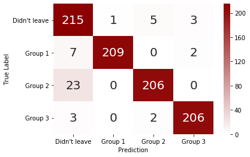


The model struggles primarily with the group of employees, who leave despite being happy with their work. Most likely there are factors not present in this dataset that better describe their reason for leaving.

## Summary
- The strongest predictors of an employee leaving are satisfaction, number of projects, working hours, and tenure at the company
- Employees who leave can be categorized into three broad groups:
    1. Underutilized employees who are, on average, indifferent to their work.
    2. Employees who leave, despite performing well and being happy, possibly due to a lack of career advancement opportunities.
    3. Overworked employees who are, on average, unhappy with their work.
- Salary has a minor effect on the probability of leaving, although this may not be a causal relationship but an accidental correlation, e.g. due to employees with a longer tenure having a higher salary.
- The department in which an employee works appears to play no significant role in predicting attrition.
- A random forest classification model can predict employee attrition with an accuracy of approximately $95\%$. It struggles more with false negatives than false positives.
- Training the classifier to identify employee subgroups shows that it struggles most with the group of leavers who are happy and perform well. Capturing additional features in the data set, such as career progression beyond the last promotion or personality traits and career wishes, may alleviate this.
